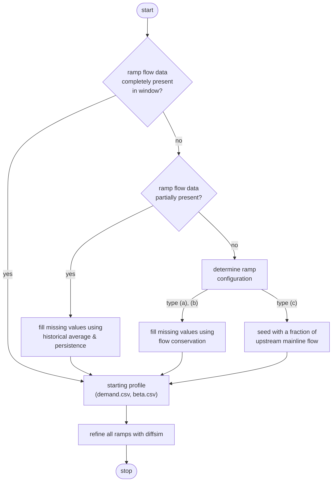
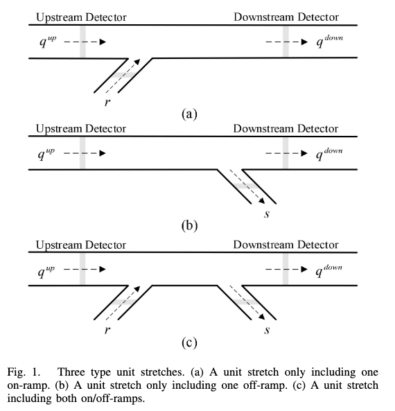

# Cell Transmission Model (CTM) Module
The cell transmission model (CTM) is a first-order macroscopic transportation model introduced by 
[Daganzo](https://www.sciencedirect.com/science/article/pii/0191261594900027?via%3Dihub) and adapted by [Munoz](https://ieeexplore.ieee.org/document/1383703). Later, [Kurzhanskiy](https://www2.eecs.berkeley.edu/Pubs/TechRpts/2007/EECS-2007-148.html) introduced the link-node cell transmission model (LN-CTM). In any case, the model discretizes a freeway into a set of n cells, each characterized by a fundamental diagram, and iteratively evolves the density of traffic within each cell according to a set of [state update equations](#ctm-state-update-equations). The [Caltrans Performance Measurement System (PeMS) database](https://dot.ca.gov/programs/traffic-operations/mpr/pems-source) is a frequently used data source for CTM case studies, thanks to its densely-instrumented network. 

Application of the CTM to a given freeway corridor involves the following steps:

1) Mapping of roadway to CTM cells
2) Mapping of VDSs to CTM cells
3) Identification of vehicle detector stations (VDSs) associated with the corridor and collection of timeseries data from each VDS
4) Calibration of fundamental diagram parameters for each available VDS
5) Manual validation of cell mappings
6) CTM freeway assembly
7) Ramp flow estimation
8) Running a CTM simulation
9) Validation against historical data

The numbering reflects the actual data-pipeline order: cell layout
(Step 1) comes first because everything downstream is keyed by cell;
VDS-to-cell mapping (Step 2) pins a detector to each cell; per-cell
timeseries (Step 3) feed the fundamental-diagram calibration (Step 4);
manual validation (Step 5) is the user's chance to fix any Step 1/2
mistakes before downstream consumption; freeway assembly (Step 6)
joins all of the above into a per-cell table ready for the engine;
ramp-flow estimation (Step 7) supplies the time-varying on-ramp
demand and off-ramp split-ratio inputs the scenario needs; Step 8
runs the simulation end-to-end; and Step 9 compares the result
against historical PeMS observations to validate the fit.

**Where assembled corridors live.** Running this pipeline produces
per-corridor *case studies*, tracked in the repo under
[`case_studies/`](../case_studies) (not `scripts/output/`) so that
manual edits to `cells.csv` are version-controlled. Each case study is
one corridor stretch named `{route}{dir}_{length}` (e.g. `I880N_10mi`)
and holds the common corridor files (`cells.csv`, `freeway.csv`,
`corridor.json`, plus GIS artifacts) alongside one subdirectory per
simulation scenario (e.g. `no_ramps`, `histAve_ramps`, `persist_ramps`,
`qp_ramps`), each carrying that run's outputs. Treat that directory as
the source of assembled corridors for any downstream analysis.

## Table of Contents

- [Step 1: Roadway --> Cell Mapping](#step-1-roadway----cell-mapping)
- [Step 2: VDS --> Cell Mapping](#step-2-vds----cell-mapping)
- [Step 3: VDS Timeseries Download](#step-3-vds-timeseries-download)
- [Step 4: Fundamental Diagram Calibration](#step-4-fundamental-diagram-calibration)
- [Step 5: Manual Validation of Cell Mappings](#step-5-manual-validation-of-cell-mappings)
- [Step 6: CTM Freeway Assembly](#step-6-ctm-freeway-assembly)
  - [Stage 1: Mainline join + per-lane → per-cell scaling](#stage-1-mainline-join--per-lane--per-cell-scaling)
  - [Stage 2: Ramp capacity lookup](#stage-2-ramp-capacity-lookup)
  - [Stage 3: $\Delta T$ advisory](#stage-3-delta-t-advisory)
  - [CLI](#cli)
- [Step 7: Ramp Flow Estimation](#step-7-ramp-flow-estimation)
- [Step 8: Running a CTM Simulation](#step-8-running-a-ctm-simulation)
  - [Inputs](#inputs)
  - [Stage 1: Build the `Freeway`](#stage-1-build-the-freeway)
  - [Stage 2: Build the `Scenario`](#stage-2-build-the-scenario)
  - [One-shot CLI](#one-shot-cli)
  - [Stage 3: Run the simulation and inspect](#stage-3-run-the-simulation-and-inspect)
  - [Round-trip against CTMSIM (already wired)](#round-trip-against-ctmsim-already-wired)
  - [Unfinished work](#unfinished-work)
- [Step 9: Validation Against Historical Data](#step-9-validation-against-historical-data)
  - [Time alignment](#time-alignment)
  - [Lane-count contract](#lane-count-contract)
  - [RMSE and MAPE](#rmse-and-mape)
  - [Output](#output)
  - [CLI](#cli-2)
  - [Ramp gap-fill accuracy](#ramp-gap-fill-accuracy)
  - [CTMSIM ground-truth comparison](#ctmsim-ground-truth-comparison)
  - [Roadmap](#roadmap)
- [CTM State Update Equations](#ctm-state-update-equations)
  - [Notation (units per Kurzhanskiy Table 4.1)](#notation-units-per-kurzhanskiy-table-41)
  - [CTMSIM update (canonical)](#ctmsim-update-canonical)
  - [Equivalent four-mode form (Muralidharan & Horowitz)](#equivalent-four-mode-form-muralidharan--horowitz)
  - [Cell-length rule (Step 5)](#cell-length-rule-step-5)

## Step 1: Roadway --> Cell Mapping
Implemented in `ctm_for_dwc.utils.ctm.osm` (corridor extraction),
`ctm_for_dwc.utils.ctm.cells` (cell layout), and
`ctm_for_dwc.utils.ctm.caltrans` (optional Caltrans postmile
annotation). End-to-end demo: `scripts/build_ctm_from_osm.py`.

The mapping is a three-stage pipeline that takes an OpenStreetMap network for a
region and emits a freeway-schema cell table ready for
`utils.ctm.io.freeway_from_dataframe`. Each stage is intentionally small so it
can be tested and swapped in isolation.

**Stage 1: OSM → `Corridor`.** The caller fetches a roadway graph via any
osmnx download method (`graph_from_bbox`, `graph_from_place`,
`graph_from_polygon`, `load_graphml`, …) and runs `ox.simplify_graph` on it.
`corridor_from_graph(graph, ref="I 880", direction="N")` then:

1. Filters edges to `highway=motorway` matching the requested `ref` (matches a
   bare string, list-valued OSM tags, or `;`-joined values).
2. Drops mainline edges whose bearing is more than `bearing_tolerance` degrees
   off the requested direction, which picks one carriageway out of a
   bidirectional bbox.
3. Takes the largest weakly-connected component of what remains.
4. Walks the result upstream → downstream, picking the dominant carriageway at
   every fork via a `(lanes, length, bearing-closeness)` tuple score. This
   tolerates OSM's habit of tagging parallel HOV / express / auxiliary lanes
   with the same `ref` as the trunk (e.g., I-880 in Hayward, I-210 in Pasadena
   where the bbox truncates an HOV stub a few meters from the trunk).
5. Identifies ramps as `highway=motorway_link` edges with exactly one endpoint
   on the mainline path (source on mainline ⇒ off-ramp; sink on mainline ⇒
   on-ramp).
6. Optionally crops to `pm_range=(lo, hi)` in cumulative-mile coordinates.

The output `Corridor` holds an ordered list of `MainlineSegment`s
(geometry, lane count, `pm_start`/`pm_end` in cumulative miles from upstream)
and `RampJunction`s (kind, postmile, gore-point geometry, ramp name).

If the user doesn't know the right OSM `ref` for a region, `summarize_refs(g)`
inventories the refs present, ranked by total mainline length, with the
most-common OSM `name` tag attached (e.g. `Nimitz Freeway` for `I 880`).
`scripts/list_osm_refs.py` is the CLI wrapper.

**Stage 2 (optional): Caltrans postmile annotation.** When
`corridor_from_graph(..., postmiles=path_or_gdf)` is given a Caltrans SHN
postmile dataset (point geometries with `Route` and `PM` columns), it
attaches a `caltrans_postmiles: dict[node_id → PM]` to the corridor. For each
mainline node it finds the nearest matching-route marker and adjusts that
marker's PM by the signed distance along the mainline from marker to node,
using the route's direction convention (PMs increase N/E along the route, so
westbound and southbound corridors get monotonically *decreasing* PMs along
travel — matching what CTMSIM / the dissertation report). The downloader
`download_caltrans_postmiles(routes=[880])` pulls a route-filtered subset
from the Caltrans FeatureServer (≈1 MB per route, vs ~144 MB statewide) and
caches it under `data/caltrans/` (gitignored).

**Stage 3: cell layout.** `cells_from_corridor(corridor)` collects breakpoints
from the union of on-ramp gores, off-ramp gores, mainline lane-count changes,
the corridor endpoints, and any `extra_break_postmiles` the caller passes in
(Step 2 uses the last to enforce "one VDS per cell"). Adjacent breakpoints
become cells, and each cell records `length`, `lanes`, `on_ramp`, `off_ramp`,
the ramp names if present, and — when Caltrans PMs were attached in stage 2 —
`caltrans_pm_start`/`caltrans_pm_end`. The resulting DataFrame slots directly
into `freeway_from_dataframe` once Step 4 supplies the FD parameters.

**Cell-length sanity check.** `flag_cell_length_warnings(cells_df, *,
min_length=0.2, max_length=1.0)` annotates the cells DataFrame with a
`length_warning` column flagging cells outside `[min_length, max_length]`
miles. Two regimes get flagged:

* `"too_short"` (length < 0.2 mi): forces the **CFL-bounded
  (Courant–Friedrichs–Lewy)** sampling period to be uncomfortably
  small. The CTM update requires $v_{f,i}\,\Delta T \le l_i$
  (Kurzhanskiy 2007 eq. 4.1) — a vehicle at free-flow speed must not
  traverse more than one cell per sim step — so at $v_f$ = 65 mph a
  0.2-mi cell already caps $\Delta T$ near 11 s, and anything shorter
  pushes the engine toward sub-10-s timesteps. Later steps (notably
  Step 6's $\Delta T$ advisory) refer back to this CFL bound; the
  acronym is introduced here.
* `"too_long"` (length > 1.0 mi): the cell averages over too much
  spatial heterogeneity (multiple lane-add/-drop sections or more than
  one bottleneck) for the CTM dynamics to stay realistic.

`scripts/build_ctm_from_osm.py` runs this automatically and prints a
one-line summary (`length warnings : too_short=N, too_long=M`). The
column survives into both `cells.csv` and `cells.geojson` so a quick
QGIS filter (`length_warning != 'ok'`) lights up the at-risk cells.
Step 5 (cell-length tuning) addresses the long-cell case by splitting;
the short-cell case typically calls for merging upstream-or-downstream
with a neighbor or accepting the tighter $\Delta T$.

**Round-trip sidecars.** Alongside `cells.csv` / `cells.geojson` /
the two PNGs, the build script also writes `mainline.geojson`,
`ramps.geojson`, and `corridor.json` — together these capture the
corridor's geometry + metadata (`ref`, `direction`, `target_bearing`,
`crs`, optional Caltrans postmile lookup) without depending on the live
osmnx graph. `corridor_to_artifacts` / `corridor_from_artifacts` in
`utils.ctm.cells` write and read this trio; Step 5's regenerator script
uses them to rebuild `cells.geojson` and the PNGs after a user
hand-edits `cells.csv`.

The CTMSIM/dissertation convention that "on-ramps live at the *start* of a
cell, off-ramps at the *end*" is encoded exactly here: a cell's `on_ramp`
flag is True iff its `pm_start` sits on an on-ramp gore, and `off_ramp` iff
its `pm_end` sits on an off-ramp gore. A ramp at the corridor's upstream or
downstream end therefore belongs to the first or last cell; co-located
on + off ramps split cleanly across adjacent cells (off → upstream cell,
on → downstream cell).

Because the on-ramp lives at the cell's upstream edge, on-ramp vehicles
have a full ΔT to traverse the cell at free-flow speed (the CFL condition
$v_{f,i}\Delta T \le l_i$ guarantees they don't overshoot). They therefore
*do* contribute to the cell's sending function in the same step, which
fixes the on-ramp blending factor at $\gamma_i = 1$. `Cell.gamma` defaults
to 1.0 accordingly (matching CTMSIM canonical); the dissertation's
Examples 1 and §3.4 — which are stated in the Gomes & Horowitz / four-mode
form with $\gamma_i = 0$ — pin γ explicitly in
`utils.ctm.examples`. The on-ramp allocation factor $\xi_i$ is orthogonal
to ramp position (it controls how much of the cell's empty space the
on-ramp can fill) and defaults to 1.0, matching both conventions.

**Validation.** The Hayward I-880 N case end-to-end: `python
scripts/build_ctm_from_osm.py --bbox -122.08,37.57,-122.04,37.62 --ref "I 880"
--direction N --postmiles auto` extracts 8 mainline segments and 7 cells over
3.89 mi with Caltrans PM 10.9 → 14.7 (NB direction → PMs increase along
travel). The I-210 W golden test against the Kurzhanskiy 2007 dissertation
fixture (`ctmsim_configs/w060412.mat`) confirms the corridor's Caltrans PMs
span the dissertation's PM 24-39 range when anchored at Vernon Ave and the
SR-134 split.

## Step 2: VDS --> Cell Mapping
Implemented in `ctm_for_dwc.utils.ctm.vds`. End-to-end demo:
`scripts/build_ctm_from_osm.py --pems-metadata {auto|PATH}`.

Step 2 attaches a PeMS vehicle detector station (VDS) to every cell produced
by Step 1, in three thin layers mirroring the Step-1 layout. The output is
the data Step 4 (FD calibration) needs to look up time series per cell.

**Stage 1: PeMS metadata → filtered VDS GeoDataFrame.**
`load_pems_station_metadata(source, *, freeway, direction, mainline_only=True)`
reads a PeMS `station_meta` text file (column schema: `ID`, `Fwy`, `Dir`,
`District`, `County`, `Abs_PM` / `Abs PM`, `Latitude`, `Longitude`, `Lanes`,
`Type`, `Name`, …) and emits a WGS-84 GeoDataFrame filtered to one freeway
+ direction + (by default) `Type=='ML'` mainline stations. Aliases like
`Lat`/`Lng` are tolerated so the loader works on either PeMS export
spelling.

For users who don't already have the file on disk,
`download_pems_station_metadata(district, ..., out_path=None)` wraps the
existing `PeMSDownloader` to fetch the latest snapshot for a Caltrans
district. Credentials come from `PEMS_USERNAME` / `PEMS_PASSWORD` (auto-
loaded from `.env`); the default cache directory is `data/pems/`
(gitignored). The module docstring documents the manual-download path too
(browse to `pems.dot.ca.gov?dnode=Clearinghouse&type=meta`, sign in, pick
the district, drop the resulting `.txt` anywhere on disk, and point
`load_pems_station_metadata` at it).

**Stage 2: project VDSs to the corridor.**
`project_vds_to_corridor(vds_gdf, corridor, *, max_lateral_distance_m=100.0)`
projects each VDS POINT onto the corridor's mainline LineStrings (one
node-to-node segment at a time), picking the segment that minimizes
perpendicular distance from the POINT to the polyline. For each VDS it
records:

* `pm_cum`             — corridor postmile (cumulative miles from upstream end)
* `pm_caltrans`        — Caltrans postmile, interpolated from
                         `Corridor.caltrans_postmiles` when present
* `seg_index`          — which mainline segment caught the projection
* `lateral_distance_m` — perpendicular distance from POINT to centerline

VDSs whose `lateral_distance_m` exceeds `max_lateral_distance_m` (100 m by
default) are dropped — these are stations on the same freeway but outside
the bbox we extracted, for which `shapely.LineString.project` clamps to an
endpoint and the postmile is meaningless. `pm_caltrans` vs PeMS-reported
`Abs_PM` is the independent sanity check the integration test runs to
verify the projection sits where it should.

**Stage 3: assign VDSs to cells.**
`assign_vds_to_cells(cells_df, vds_projected, *, fallback="upstream",
tiebreaker="midpoint")` walks the cells produced by `cells_from_corridor`
and attaches a VDS to each one. The interval check matches the ramp
convention from Step 1 — VDSs in $(\text{pm\_start}, \text{pm\_end}]$
belong to that cell, so a VDS exactly on a cell boundary goes to the
upstream cell:

1. **Direct match.** If exactly one VDS lands in the cell, it's the
   `direct` assignment.
2. **Tiebreaker.** Multiple VDSs in one cell are resolved by the
   `tiebreaker` setting (`"midpoint"` — closest to the cell's pm midpoint,
   the default; `"lowest_id"` — smallest `vds_id` for full determinism;
   `"highest_pm_observed"` — placeholder for the future Step-2 data-
   quality hook). The cell is flagged `direct_tiebreak` and
   `vds_n_candidates >= 2` so downstream consumers can inspect.
3. **Downstream-assignment fallback (Dervisoglu et al. 2014).** If no VDS
   lives in the cell and `fallback="upstream"`, the cell inherits the
   `vds_id` from the closest *upstream* cell that has one. This is the
   scheme described in Dervisoglu, Kurzhanskiy, Gomes & Horowitz,
   "Macroscopic Freeway Model Calibration with Partially Observed Data, a
   Case Study," American Control Conference 2014 (IEEE Xplore #6859026),
   §III: each detector's calibrated FD is assigned to the cell it sits in
   and then assigned downstream until another detector is encountered.
   The cell is flagged `nearest_upstream` and `vds_distance_mi` records
   the signed gap (negative = how far upstream the inherited VDS is).
4. **Missing.** Cells upstream of every VDS in the corridor stay
   `missing` (no inherit-from-future), with `vds_id` set to `<NA>`.

The optional `min_lane_match=True` flag mirrors the existing
`utils/representation.py` behavior of preferring VDSs whose lane count
matches the cell's `lanes` column when multiple candidates are available.

**Output.** `cells.csv` gains these columns: `vds_id` (Int64, `<NA>` only
on `missing`), `vds_pm`, `vds_source` (`direct` / `direct_tiebreak` /
`nearest_upstream` / `missing`), `vds_distance_mi` (signed; nonzero only
for `nearest_upstream`), and `vds_n_candidates` (count of direct
candidates; >1 means a tiebreaker fired). Step 4 picks up the
`vds_id` column to find the matching `.gz` time-series file per cell.

**Validation.** Running the demo on the cached I-210 W graph with the
cached PeMS D7 snapshot —

```
python scripts/build_ctm_from_osm.py \
    --graphml tests/fixtures/osm/i210_bbox.graphml \
    --ref "I 210" --direction W --postmiles auto \
    --pems-metadata tests/fixtures/pems/d07_meta_2023_12_22.txt
```

— produces 45 cells over 12.6 mi with VDS sources `direct=18`,
`direct_tiebreak=4`, `nearest_upstream=22`, `missing=1`. 26 mainline VDSs
in the corridor span (~2.1 / mi, in the ballpark of CTMSIM's ~2.8 / mi),
with median lateral distance to the centerline under 3 m and Caltrans-PM
projection within 0.5 mi of PeMS's reported `Abs_PM` for most stations.

## Step 3: VDS Timeseries Download
Implemented by two classes in `ctm_for_dwc.utils.data_downloading`:
`PeMSDownloader` (clearinghouse query + batch download) and `PeMSExtractor`
(per-detector parsing of the downloaded `.gz` files). End-to-end demo:
`scripts/download_pems_timeseries.py`.

Step 2 has already pinned a specific `vds_id` to every cell, so this step
only needs to fetch the time series for those particular detectors. The
union of `cells.csv`'s `vds_id` column is the exact list to pass as
`--detectors`; Step 4 picks the resulting per-cell CSVs up by joining on
the same column.

(Station metadata downloads — the *spatial* side of "VDS identification" —
live in Step 2 as `download_pems_station_metadata`; this step is
specifically the *timeseries* download that Step 4 calibrates against.)

**Stage 1: clearinghouse query + download.** `PeMSDownloader` authenticates
to `pems.dot.ca.gov` with the user's PeMS credentials (browser-driven via
`mechanize`) and parses the embedded form metadata so callers can query
without knowing the clearinghouse's parameter names:

* `get_file_types()` / `get_districts(file_type)` enumerate what the
  account can see.
* `get_files(start_year, end_year, districts, file_types, months)` returns
  a list of file-metadata dicts (`file_name`, `file_id`, `megabites`,
  `download_url`, …) matching the filter. Useful for previewing the size
  of a download.
* `download_files(...)` iterates the same list, downloads each new file
  to `save_path`, and appends to a `saved_files.csv` lookup so reruns
  skip files already on disk (the dedupe key is the full row, not just
  the filename).

The downloader uses `mechanize.Browser.retrieve` to stream files to disk,
so even a multi-GB month's worth of `station_5min` data flows through a
single chunk-sized buffer.

**Stage 2: per-detector extraction.** `PeMSExtractor` walks a directory of
`.gz` dumps and emits one CSV per VDS under `<save_path>/csv_files/`.
The PeMS 5-minute format is a headerless CSV with 12 station-level
columns followed by 5 columns per lane; the extractor infers the lane
count from each file's column count and renames the columns on the way
in. Memory is bounded by `process_gz_files`'s per-file streaming: it
loads one `.gz` at a time, slices by `station` ID into per-detector
DataFrames, writes/appends to the corresponding `.csv`, and discards the
file before moving on. The downloader-level "skip already-fetched files"
lookup combined with the extractor-level "append + dedupe" on each
output CSV makes the whole pipeline incremental — re-running with a
wider time window only fetches the new files and grows each per-detector
CSV with the new rows.

Optional time-window clipping: `PeMSExtractor(..., start_date=...,
end_date=..., start_time=..., end_time=...)` drops rows outside that
window at file-load time, so very long histories can be trimmed down to
a calibration-relevant span without ever materializing the full corpus.

**Demo CLI.** `scripts/download_pems_timeseries.py` wires the two classes
into one invocation:

```
python scripts/download_pems_timeseries.py \
    --district 4 --year 2022 --month January \
    --detectors 400839,400840
```

Flags: `--district`, `--year` (or `--year-start` / `--year-end`),
`--month`, `--detectors`, optional `--start-date` / `--end-date`
clipping, and `--out-dir` (default: `<repo>/data/pems/timeseries/`, in
the gitignored `data/` tree). Credentials come from
`PEMS_USERNAME` / `PEMS_PASSWORD` (auto-loaded from `.env`); pass
`--extract-only` to skip the download and just re-extract whatever
`.gz` files are already on disk (the path for users who'd rather grab
files by hand from the clearinghouse web UI at
`https://pems.dot.ca.gov/?dnode=Clearinghouse&type=station_5min`).

**Test surface.** 38 unit tests in `tests/test_pems_downloader.py` and
`tests/test_pems_extractor.py` cover the parsing, URL construction,
dedupe, and lane-count inference paths. The extractor tests use ≈ 10-row
synthetic `.gz` files written to `tmp_path` so the suite stays under
the file-size budget; the downloader tests stub the two network seams
(`_open_url` and `_download_file`) via `monkeypatch` rather than hitting
the live clearinghouse. The live login path itself is exercised
indirectly by the `@pytest.mark.network` round-trip in
`test_ctm_caltrans.py` (which goes through the same
`PeMSDownloader.__init__`).

## Step 4: Fundamental Diagram Calibration
Implemented in `ctm_for_dwc.utils.ctm.fd_calibration` (the FD plot is
`utils.ctm.plots.plot_fundamental_diagram`). End-to-end demo:
`scripts/calibrate_fundamental_diagrams.py`.

For each VDS produced by Step 3, this step fits the five-parameter
triangular FD ($q_{max,i}$, $v_{f,i}$, $w_i$, $\rho_{jam,i}$,
$\rho_{crit,i}$) from the (density, flow) cloud observed by that
detector. Keyed on `Station ID`, the calibrated parameters slot into
`cells.csv` via the `vds_id` column attached in Step 2, completing the
freeway schema required by `utils.ctm.io.freeway_from_dataframe`.

**Per-detector pipeline.** For each detector,
`calibrate_fundamental_diagrams`:

1. `load_detector_timeseries` reindexes the per-VDS CSV from Step 3 to a complete
   5-minute grid (gaps become NaN rows).
2. `standardize_timeseries` converts the PeMS-native
   `total_flow_[veh/5-min]` + `avg_speed_[mph]` into per-lane flow
   `flow_[veh/hr-lane]` and per-lane density `density_[veh/mi-lane]`.
3. Rows with `pct_observed < imputation_threshold` (default 100) are
   dropped.
4. `whiten_flow` z-scores flow against its per-
   (weekday, 5-min-block) statistics so the outlier rejector below
   doesn't get fooled by morning-peak vs midnight-shoulder differences.
5. `filter_flow_outliers` drops rows outside an IQR fence on
   `whitened_flow` (default `iqr_multiplier=1.0`).
6. `fit_fundamental_diagram` fits the FD:

   * **Free-flow regime**: seed the critical-density estimate from the
     row with the highest observed flow, then fit
     $\text{flow} = v_{f,i}\,\rho$ (no intercept) over the points with
     $\rho \le$ the seed. The fitted slope is $v_{f,i}$.
   * **Congestion regime**: sort the points with $\rho >$ the seed by
     density, bin them in non-overlapping blocks (default 10 points per
     bin), drop in-bin whitened-flow outliers above
     $Q_3 + k\cdot\mathrm{IQR}$, and pair each bin's mean density with
     its max flow. Fit a straight line through those (density, max-flow)
     points; the slope is $-w_i$ and the x-intercept is $\rho_{jam,i}$.
   * **Peak**: intersect the two fitted lines analytically. The
     intersection's $x$ is $\rho_{crit,i}$ and $y$ is $q_{max,i}$.

7. If `plot_dir` is given, render the raw scatter + fitted lines + binned
   congestion points + capacity/critical/jam reference lines into a
   per-detector PNG via `plot_fundamental_diagram`.

**Batch writeback.** `calibrate_fundamental_diagrams` returns the station
metadata with the five calibrated columns (plus `calibration_code` /
`calibration_status`) filled in, and with `output_path` writes it as
`station_metadata_calibrated.csv`. An existing output file is updated
incrementally: detectors not in the current run keep their previous
calibration. Subsequent runs of
Step 1 can read this CSV directly as a drop-in replacement for the raw
PeMS metadata.

**CLI demo.** `scripts/calibrate_fundamental_diagrams.py` wires the
whole pipeline together:

```
python scripts/calibrate_fundamental_diagrams.py \
    --root-directory data/pems --detectors 400839,400840 --make-plots
```

Flags: `--root-directory` (defaults to `<repo>/data/pems`),
`--metadata` (explicit path; defaults to
`<root>/metadata/station_metadata.csv`), `--detectors` (default = all
mainline), `--imputation-threshold`, `--iqr-multiplier`,
`--make-plots`, and `--out-dir` (default
`<repo>/data/pems/calibrated/`, gitignored). The calibrated metadata is
written to `<out-dir>/station_metadata_calibrated.csv`; PNGs land under
`<out-dir>/plots/` when requested.

**Test surface.** 29 unit + integration tests across
`tests/test_fundamental_diagram.py` and
`tests/test_calibrate_fundamental_diagrams.py` cover the primitives
(`estimate_free_flow_speed` recovers the line slope; the cutoff drops
congestion points; `estimate_congestion_wave_speed` recovers the wave
speed and jam density; `find_fundamental_diagram_peak` intersects two
fitted lines correctly), the per-detector wrapper (synthetic triangular
FD → recovered parameters within 1.5%), `validate_fd_params`, the loader
(gaps stay NaN rows on a contiguous grid), the batch driver
(`calibrate_fundamental_diagrams` writes the right CSV only when given
`output_path`; records a calibration code for missing, empty and
free-flow-only detectors; the plotter emits a non-empty PNG), and
`calibrate_ramp_capacities`. The integration
tests use ~4 weeks of synthetic 5-minute CSVs under `tmp_path` so the
suite stays light without hitting real PeMS data.

**Ramp capacities.** Ramp VDSs (PeMS `Type ∈ {OR, FR}`) report total
5-minute flow but not speed, so a full FD calibration isn't possible.
`calibrate_ramp_capacities(detectors, metadata_path, timeseries_dir, *, quantile=0.99)`
runs a lighter pipeline on each ramp VDS:

1. Load the 5-min timeseries and drop rows below the imputation threshold
   on `pct_observed`.
2. Convert `total_flow_[veh/5-min]` to `flow_[veh/hr]` by × 12. Total
   flow (not per-lane) is the right thing here because the CTM's
   $R_i$ / $S_i$ are the ramp's total in/out capacity.
3. Whiten `flow_[veh/hr]` against its per-(weekday, 5-min-block) mean
   and stddev, then drop outliers via an IQR fence on `whitened_flow`.
4. Take the `quantile` of the cleaned raw flow as the ramp's capacity
   in veh/hr. The default 0.99 is robust to a single spike while
   preserving the genuine observed peak.

The output `ramp_metadata_calibrated.csv` is keyed on `Station ID` with
columns `ramp_capacity_[veh/hr]` and `n_observations`. Ramps with no
timeseries on disk (Step 3 wasn't run for that detector, or PeMS
returned no data) get `ramp_capacity_[veh/hr]=NaN`, which Step 6's
assembly translates into $R_i = \infty$ — the right "no measurement →
no constraint" fall-back; the CTM cell defaults already allow
infinite ramp capacity (`utils.ctm.io` schema: `on_ramp_capacity`
defaults to `inf` when missing/NaN).

**Calibration philosophy: data-driven, not knob-based.** CTMSIM
exposes per-cell calibration multipliers (`ORknob`, `FRknob`) that the
operator hand-tunes to match observed corridor behavior. Our pipeline
takes a different route: the on-ramp demand $d_i(k)$ comes straight
from the observed ramp VDS flow (Step 7's `demand_from_ramp_vds`),
the off-ramp split $\beta_i(k)$ comes from `s_i / (f_i + s_i)`
computed from observed flows, and the ramp capacities $R_i$ / $S_i$
come from the 99th-percentile measurement above. No per-cell knob
layer — the measurements *are* the calibration. (When we round-trip a
CTMSIM `.mat` for validation, our adapter does apply CTMSIM's
`ORknob` so the comparison is apples-to-apples — see Step 9.)

The Step-4 CLI gets a `--ramp-detectors <comma,list>` flag that runs
this pass alongside the mainline FD calibration:

```
python scripts/calibrate_fundamental_diagrams.py \
    --root-directory data/pems \
    --detectors 400839,400840 \
    --ramp-detectors 717123,717150
```

Pick the ramp VDS list from the `on_ramp_vds_id` and `off_ramp_vds_id`
columns in your Step-1 `cells.csv` (Step 2's `assign_ramp_vds_to_cells`
fills those in). Step 3's downloader is unchanged — pass the same ramp
VDS list as `--detectors` to fetch their `.gz` timeseries first.

## Step 5: Manual Validation of Cell Mappings

The automatic mappings in Steps 1 and 2 get you 90% of the way there, however 
some manual inspection of the result is necessary. For this purpose, .geojson 
files are generated in `build_ctm_from_osm.py`, which makes it easy to overlay
the cell mapping results onto a satellite image or OpenStreetMap basemap in a GIS
software like QGIS.

Specific aspects to consider:
* Lane discrepancies between OSM, PeMS, and satellite images
* Cell merging for length
* VDS assignment overrides. The mainline `vds_id` Step 2 attaches to
  each cell is the *physically closest* detector, which isn't always
  the best FD source -- a detector with a poorly-calibrated
  fundamental diagram can leave a cell with bad parameters even
  though the detector itself is correctly assigned. To redirect the
  FD lookup without losing the audit trail, add an optional
  `fd_vds_id` column to `cells.csv` and set it to the *override*
  VDS id only for the cells that need it (leave it NaN otherwise).
  `assemble_freeway_table` then uses `fd_vds_id` for the FD lookup
  (falling back to `vds_id` per row when `fd_vds_id` is NaN), while
  the rest of the pipeline (initial-state extraction, off-ramp
  split-ratio computation) continues to use `vds_id` so the cell's
  observed traffic data still comes from the physically nearest
  detector. As of the `calibration_code` integration, Step 6 already
  **auto-seeds** this redirect for cells whose detector outright
  *failed* calibration (see Step 6, Stage 1) — so this manual step is
  now mostly for cells whose detector calibrated "successfully" but to
  a visibly poor FD, which the code can't catch. A manual `fd_vds_id`
  always overrides the auto choice.
* Ramp VDS assignments. A single cell can carry **multiple** ramp VDS
  ids if more than one physical ramp falls inside it (e.g. when two
  short on-ramps were merged into one cell). Put the ids in the
  `on_ramp_vds_id` / `off_ramp_vds_id` cell as a string separated by
  `,`, `;`, or whitespace -- e.g. `"717123;717150"` or
  `"717123, 717150"`. Step 6 (`assemble_freeway_table`) and Step 7
  (`demand_from_ramp_vds` / `beta_from_off_ramp_vds`) both parse this
  via `parse_ramp_vds_ids` and **sum** the per-ramp capacities and
  flows into the cell's :math:`R_i`, :math:`d_i(k)`, or :math:`s_i(k)`.
* Virtual ramp detectors. A physical ramp with **no PeMS detector at
  all** gets a synthetic `v`-prefixed id (e.g. `v400001`) instead of a
  real VDS id. Use the same id for the ramp in `cells.csv`
  (`on_ramp_vds_id` / `off_ramp_vds_id`) and in the stretches CSV
  (`on_ids` / `off_ids`), and keep ids unique across the whole
  stretches file. See the Step 7 "Virtual ramp detectors" section for
  how each consumer treats them.

After making any manual adjustments, re-generate the derived artifacts
(`cells.geojson`, `corridor_map.png`, `cell_layout.png`) from the
updated `cells.csv` with `scripts/regenerate_cell_artifacts.py`:

```
python scripts/regenerate_cell_artifacts.py \
    --dir scripts/output/ctm_corridor/I_210_W
```

The regenerator reads the round-trip sidecars from Step 1
(`mainline.geojson`, `ramps.geojson`, `corridor.json`) so it does **not**
need the original osmnx graph or Caltrans postmile dataset. It also
re-runs `flag_cell_length_warnings` on the edited table so the
`length_warning` column stays consistent with the new lengths.

## Step 6: CTM Freeway Assembly
Implemented in `ctm_for_dwc.utils.ctm.assembly`. End-to-end
demo: `scripts/assemble_ctm_freeway.py`.

This step joins three independent artifacts into a single per-cell freeway
table that slots directly into `utils.ctm.io.freeway_from_dataframe`:

| input                                  | source                          | role                                                |
|----------------------------------------|---------------------------------|-----------------------------------------------------|
| `cells.csv`                            | Step 1+2 (+ Step-5 user edits)  | cell geometry, lane count, mainline + ramp VDS ids  |
| `station_metadata_calibrated.csv`      | Step 4 (mainline)               | per-VDS triangular FD parameters, **per-lane units**|
| `ramp_metadata_calibrated.csv`         | Step 4 (ramps; optional)        | per-VDS ramp capacity, **total flow [veh/hr]**      |

### Stage 1: Mainline join + per-lane → per-cell scaling

For each cell, `assemble_freeway_table` joins on `vds_id` (or
`fd_vds_id` when present and non-NaN -- see the Step-5 manual-edit
section above) to pull the calibrated FD parameters, then **scales
per-lane FD quantities by the cell's lane count** to land in the
per-cell units the CTM engine expects:

| FD parameter     | calibrated units        | per-cell scaling           |
|------------------|-------------------------|----------------------------|
| `q_max`          | veh/hr-lane             | × `lanes` → veh/hr         |
| `rho_jam`        | veh/mi-lane             | × `lanes` → veh/mi         |
| `rho_crit`       | veh/mi-lane             | × `lanes` → veh/mi         |
| `v_f`            | mi/hr (intensive)       | unchanged                  |
| `w`              | mi/hr (intensive)       | unchanged                  |

The `fd_vds_id` override is **opt-in and per-row**: leave the column
out entirely (or NaN) and the FD lookup uses `vds_id` for every cell
just as before. Set it to the FD-source VDS only for the cells where
the user wants to redirect the FD parameters.

**Automatic FD redirect on calibration failure.** When the calibrated
metadata carries a `calibration_code` column (Step 4 always writes
one), assembly auto-seeds the `fd_vds_id` redirect that a Step-5
reviewer used to do by hand. For any cell *without* a manual
`fd_vds_id` whose `vds_id` failed calibration (`calibration_code != 0`,
so its FD parameters are NaN), the FD lookup is redirected to the
nearest **upstream** cleanly-calibrated detector (`calibration_code ==
0`) — the same Dervisoglu upstream-inherit idea Step 2 applies to
*missing* detectors, here applied to FD *quality*. The substitution
never touches `vds_id` (so initial-state and split-ratio derivations
still use the physically-nearest detector), a manually-set `fd_vds_id`
always wins, and each redirect is reported via a `logging` warning
(`cell idx: vds <bad> (code N) -> vds <substitute>`). This only
*seeds* the override — Step 5's manual review still applies and can
correct any auto-choice. A calibration table that predates the
`calibration_code` column disables the redirect entirely, so the
behavior is backward compatible.

Cells whose effective FD-lookup id is NaN (both `vds_id` and
`fd_vds_id` missing) raise a `ValueError` -- they need a calibrated
FD before assembly proceeds, so the caller has to run Step 2's
Dervisoglu upstream-inherit fallback or edit the cells table to
point at a sensible VDS first. A cell whose `vds_id` *failed*
calibration and has no cleanly-calibrated detector anywhere upstream
(and no manual `fd_vds_id`) likewise raises -- set `fd_vds_id`
manually or extend the corridor upstream to include a good detector.

### Stage 2: Ramp capacity lookup

If a `ramp_calibrated_df` is supplied, cells with `on_ramp=True` have
their $R_i$ looked up by `on_ramp_vds_id`; similarly `off_ramp=True`
cells get $S_i$ from `off_ramp_vds_id`. Cells whose ramp VDS is missing
from the calibration table -- because Step 3 didn't download that ramp's
timeseries, or because no PeMS ramp detector was close enough at
assignment time -- get `NaN`. `freeway_from_dataframe` reads NaN as the
"no constraint" sentinel and instantiates the cell with
$R_i = \infty$ / $S_i = \infty$, which the CTM engine handles natively
(the `min{...}` in the on-ramp / mainline update equations simply drops
the ramp-capacity term).

When a cell carries a **list** of ramp VDS ids (Step-5 manual edit, see
above), the per-VDS capacities are **summed** into the cell's
$R_i$ / $S_i$. Partial coverage -- some ids present in the
calibration table, others absent -- emits a `UserWarning` and sums the
present ones (treating missing ids as 0). If every id in the list is
absent, the cell falls back to the NaN / ∞ default.

### Stage 3: $\Delta T$ advisory

The CFL condition $v_{f,i}\,\Delta T \le l_i$ (Kurzhanskiy 2007 eq. 4.1)
caps the stable sim timestep at
$\Delta T_{\max} = \min_i l_i / v_{f,i}$. `compute_cfl_advisory` returns
the per-cell bounds, the binding cell, and a suggested round
$\Delta T$ -- the largest 5-second multiple strictly below the bound
(or the bound itself if it sits below 5 seconds). The assembly script
prints this advisory verbatim:

```
=== CFL (Δt) advisory ===
  binding cell idx : 23
  binding cell     : length 0.215 mi @ v_f 65.4 mi/h
  max allowable Δt : 0.00329 h (11.8 s)
  per-cell Δt range: 11.8-58.3 s (mean 27.4 s, n=45)
  suggested Δt     : 10.0 s (largest 5-s multiple strictly below max)
```

**The assembly script stops short of building a `Freeway`.** The user
picks `dt` from the advisory and passes the freeway CSV to
`freeway_from_dataframe(df, dt=...)` themselves at simulation time --
keeping the freeway-construction (and its validation) at the moment
where `dt` is known is what `utils.ctm.io.freeway_from_dataframe` is
designed for, and decouples assembly from simulation pacing.

### CLI

```
python scripts/assemble_ctm_freeway.py \
    --cells scripts/output/ctm_corridor/I_210_W/cells.csv \
    --calibrated data/pems/calibrated/station_metadata_calibrated.csv \
    --ramp-calibrated data/pems/calibrated/ramp_metadata_calibrated.csv \
    --out scripts/output/ctm_corridor/I_210_W/freeway.csv
```

The output `freeway.csv` carries `length`, `q_max`, `v_f`, `w`,
`rho_jam`, `rho_crit`, `on_ramp`, `off_ramp`, `on_ramp_capacity`,
`off_ramp_capacity`, and `lanes` (kept for traceability). It's the same
schema as `freeway_to_dataframe`'s output minus the `gamma` / `xi`
columns (which fall back to the cell defaults).

## Step 7: Ramp Flow Estimation
Ramp flows are required boundary conditions in the CTM; they determine the number of vehicles 
entering or exiting the simulation at each cell in each timestep. We obtain ramp flows directly 
from the PeMS timeseries data, which presents a challenge for simulation when the data are missing.
There are two distinct ways in which data can be missing, which requires different estimation 
treatment. We enumerate the two types of missing data as follows:

1. There are some ramps for which no VDS has been installed, and therefore historical flow data for
the ramp is unavailable.
2. In the ramps where VDSs have been installed, there may be gaps in the timeseries data.

Step 7 runs in two stages:

1. **Starting profile** (`scripts/build_ctm_ramp_scenario.py`) -- fill every ramp from the data
   it has, following the decision flowchart below, and write `demand.csv` / `beta.csv`.
2. **Refinement with diffsim** (`scripts/optimize_ramp_flows_diffsim.py`) -- fit *every* ramp's
   `demand` / `beta` so the exact CTM reproduces observed mainline density and flow, starting
   from the stage-1 profile. Its `demand.csv` / `beta.csv` are what
   `scripts/simulate_ctm_corridor.py --demand --beta` consumes.



### Stretch identification

Ramp-configuration type and the mainline↔ramp topology are determined **directly
from PeMS station postmiles**, not from the CTM cell grid (which snaps ramps to
cell edges and filters detectors through cell assignment).
`scripts/build_pems_stretches.py` reads the PeMS station metadata and, per
`(Fwy, Dir)`, forms a *unit stretch* between each pair of consecutive mainline
(`ML`) detectors, ordered by `Abs_PM`, with the on-ramp (`OR`), off-ramp (`FR`),
and connector (`FF`) stations in between. It writes a reviewable `stretches.csv`
(one per direction) whose `config_type` column drives the dispatch below: type
(a) or (b) when the stretch holds a single ramp, type (c) when it holds ≥1
on-ramp and ≥1 off-ramp. Review the flagged rows (unresolved `FF` connectors,
open end stretches, multi-ramp interchanges) before use; rebuilding overwrites
manual edits.

### Historical Average & Persistence
This strategy is used for all Type 2 scenarios; the specific method (historical average vs. persistence) is determined based on the duration of the gap in the timeseries data.
If the gap is 1 or 2 samples, missing values are filled by persisting the most recent measurement.
If the gap is longer, missing values are filled using the historical average for that particular (day-of-week, time-of-day) slot.

### Flow conservation
This strategy applies to a subset of Type 1 scenarios, depending on the configuration of the highway stretch which contains missing ramp flow data. Configurations are shown below.



If the highway stretch contains only one ramp (type (a) or (b)), then the missing ramp flow is fully-determined by conservation of flow:

$$ q_{up} + r = q_{down} + s $$

We solve this equation for the missing ramp flow by setting whichever ramp is not present to 0 and using the mainline flow data, which we assume exists. If there are any gaps in the mainline flow, they are filled using historical average and persistence, following the same heuristic as described above.

**Caveat: raw PeMS flows do not conserve.** On fully measured type-(c) stretches
(I-880), the residual $q_{up} + r - s - q_{down}$ has a median of about
$-336$ veh/hr, and about 45% of windows have a measured on-ramp flow below the
conservation minimum $q_{down} - q_{up}$. That error is about the size of a
typical on-ramp flow (median $r \approx 348$ veh/hr). Conservation-derived
starting values can therefore be biased, and they are clipped at zero. This is
one reason diffsim refines every ramp rather than trusting the starting profile.

### Absent ramps on type-(c) stretches
With no ramp data and no conservation relation, a completely absent ramp on a
type-(c) stretch is seeded with a fraction (`--type-c-fraction`, default 0.1)
of the stretch's upstream mainline flow, with a warning, and diffsim recovers
it. The seed only needs to be non-zero (see the demand floor under
"Refinement with diffsim"). Earlier versions estimated these ramps with a trained model (a GRU, and the
methods of [Kan et al. 2021](https://doi.org/10.1109/TITS.2020.2989365) and
[Zhang et al. 2024](https://doi.org/10.1109/TITS.2023.3315693)); those were
removed once diffsim made a careful starting profile unnecessary, and remain in
git history.

### CLI

The starting profile is built by `scripts/build_ctm_ramp_scenario.py`: gap fill
(short gaps persisted, longer gaps historical-averaged), type-(a)/(b)
conservation, and a mainline-fraction seed for absent type-(c) ramps. It writes an on-ramp demand
and off-ramp split ratio profile at sim cadence.
`scripts/simulate_ctm_corridor.py` takes `--demand` / `--beta` CSVs; when they
are omitted, every cell gets zero demand and zero split ratio (ramps are
effectively ignored).

```
python scripts/build_ctm_ramp_scenario.py \
    --cells case_studies/I880N_10mi/cells.csv \
    --stretches data/pems/stretches/880_N.csv \
    --timeseries-dir data/pems/csv_files \
    --start "2022-04-12 06:00" --end "2022-04-12 09:00" \
    --dt-seconds 10
python scripts/simulate_ctm_corridor.py \
    --freeway scripts/output/ctm_corridor/I_210_W/freeway.csv \
    --cells   scripts/output/ctm_corridor/I_210_W/cells.csv \
    --timeseries-dir data/pems/csv_files \
    --dt-seconds 10 \
    --start "2022-04-12 06:00" --end "2022-04-12 09:00" \
    --demand case_studies/I880N_10mi/demand.csv \
    --beta   case_studies/I880N_10mi/beta.csv
```

### Refinement with diffsim (Level 3)

The starting profile is refined by fitting the *whole corridor* at once: find
the ramp inputs that make the CTM's mainline density **and flow** match
observed PeMS, running the **exact** forward simulator every iteration and
descending the error into the ramp inputs via autograd. `utils/ctm/diffsim.py`
is a PyTorch reimplementation of the engine step (pinned to the numpy engine by
`tests/test_ctm_diffsim.py`).

* **Decision variables** -- on-ramp-cell `demand` (kept $\ge 0$ by a clamp) and
  off-ramp-cell `beta` (kept in $(0, 1)$ by a sigmoid), for **every** ramp,
  piecewise-constant over 5-min blocks (the PeMS cadence; per-step values would
  be badly underdetermined). Observed ramp data is deliberately **not** used in
  the fit, so it stays an honest test set.
* **Objective** -- scale-normalized MSE of mainline density and flow at the
  direct/tiebreak cells on the 5-min grid, sampled exactly as Step 9 validation
  does (density at 5-min boundaries, flow block-averaged). No regularization.
* **Boundary and initial conditions** -- initial density and upstream inflow
  come from PeMS (`initial_state_from_vds`, `inflow_from_vds`) and are fixed.
* **Stopping** -- early stop on the loss (relative `--min-delta` over
  `--patience` iterations) with best-iterate restore. Per-iteration loss and
  density/flow RMSE are logged to Weights & Biases (project
  `ctm-ramp-calibration`; `--no-wandb` disables it).

**Unobserved cells (optional).** Scoring only direct-VDS cells leaves the others
free to drift. `scripts/augment_observed_grid.py` fills the full
`(n_cells, n_5min)` grid first (`utils/ctm/impute.py`): a direct-VDS cell
missing some 5-min steps is filled from the detector's own
(day-of-week, time-of-day) history, and a cell with no direct VDS by a
spatial-temporal KNN over observed and history-filled cells. The optimizer
reads these with `--imputed-dir` and weights them with `--imputed-weight`.

```
# 1. Build the input bundle (freeway, rho0, inflow, observed density/flow, meta)
python scripts/build_ctm_diffsim_inputs.py \
    --freeway case_studies/I880N_5mi/freeway.csv \
    --cells   case_studies/I880N_5mi/cells.csv \
    --timeseries-dir data/pems/csv_files \
    --start "2023-06-01 00:00" --end "2023-06-02 00:00"
# 2. (optional) impute unobserved cells of the observed grids
python scripts/augment_observed_grid.py \
    --bundle case_studies/I880N_5mi/diffsim_inputs \
    --cells  case_studies/I880N_5mi/cells.csv \
    --timeseries-dir data/pems/csv_files --k 2 --knn-decay 1.0
# 3. Optimize, starting from the build_ctm_ramp_scenario.py profile
python scripts/optimize_ramp_flows_diffsim.py \
    --bundle case_studies/I880N_5mi/diffsim_inputs \
    --init-demand case_studies/I880N_5mi/demand.csv \
    --init-beta   case_studies/I880N_5mi/beta.csv \
    --iters 3000
# -> demand.csv, beta.csv, optimize_report.json in the bundle dir
```

The starting profile must cover the same window and `dt` as the bundle (the
optimizer checks): build it with the bundle's `--start` / `--end` and
`--dt-seconds` set to the bundle's `meta.json` `dt_s`. Without `--init-demand` / `--init-beta` the
optimizer starts from zero demand and `--beta-init` at every off-ramp.

**Demand floor.** Demand is kept $\ge 0$ by a clamp, whose gradient is exactly
0 at the bound, so a demand block that *starts* at 0 never moves. Every starting
on-ramp demand is therefore raised to at least `--min-init-demand` (default
1 veh/h); any positive value is enough. This covers zero blocks from every
source: measured zeros, conservation clipped at 0, and a zero-demand start. A
block pushed below 0 *during* optimization still gets no gradient.

**Why not a convex QP.** Diffsim replaced an inverse-CTM quadratic program
(Julia/JuMP, removed; recover with `git show pre-cleanup:julia/`) that solved
for ramp flows with the CTM update equations as constraints, the CTM `min`
operators relaxed to $\le$ to stay convex, and only density in the objective.
It matched observed density almost exactly, but the recovered ramp flows were
non-unique and not a valid CTM trajectory: fed back through the exact
simulator, the results did not transfer, and got worse with corridor length.
On I-880 N (2023-06-01, 24 h), scored against historical PeMS and compared to
the historical-average ramp fill:

| case | metric | QP | histAve |
|---|---|---|---|
| 1mi (2 cells)  | density RMSE / flow RMSE | **19.9** / 638 | 24.6 / **342** |
| 1mi            | flow MAPE / GEH<5        | 12.3% / 62%    | 11.8% / 60%    |
| 5mi (14 cells) | density MAPE / flow MAPE | 47% / 50%      | **27% / 17%**  |
| 5mi            | flow RMSE / GEH<5        | 955 / 24%      | **443 / 44%**  |

Density alone does not pin the ramp flows, and a relaxed solution need not be a
physical one. Diffsim answers both: it never leaves the exact dynamics, so its
inputs round-trip by construction, and it matches flow as well as density.

### Virtual ramp detectors

A ramp that physically exists but has **no PeMS detector** carries a
synthetic `v`-prefixed id (e.g. `v400001`) in `cells.csv` and in the
stretches CSV (see the Step 5 manual-edit conventions). There is no
timeseries behind such an id, so each consumer handles it explicitly:

* **Step 6 assembly** -- the id misses the ramp-calibration lookup and
  the cell's ramp capacity stays NaN → :math:`R_i = \infty` /
  :math:`S_i = \infty` (no-measurement → no-constraint).
* **Fill-strategy adapters** (`demand_from_ramp_vds` /
  `beta_from_off_ramp_vds`) -- there is nothing to gap-fill, so virtual
  ids are **skipped with a `UserWarning`**: they contribute 0 demand,
  and 0 to the off-ramp flow :math:`s_i` (though they still count for
  the furthest-downstream mainline lookup). Estimating their flow needs
  the offline scenario builder below.
* **Offline scenario builder** (`scripts/build_ctm_ramp_scenario.py`) --
  a virtual id is "VDS completely absent" by construction and dispatches
  on the `config_type` of the stretch that lists it: conservation for
  type (a)/(b), a mainline-fraction seed for type (c). Both cover the stretch
  side's **total** ramp flow, so when the virtual ramp shares its stretch
  side with measured detectors, their historical-average-filled flows are
  subtracted from the estimate (clipped at 0) before it is assigned --
  otherwise the measured vehicles would enter the corridor twice.

Keep virtual ids **unique across the stretches file**: the id→stretch
map resolves duplicates silently to whichever stretch parses last.

## Step 8: Running a CTM Simulation
End-to-end demo: `scripts/simulate_ctm_corridor.py`.

With Steps 1-6 done you have a corridor-shaped, FD-calibrated freeway;
this step wires it through the engine. The Python entry points
(`freeway_from_dataframe`, `scenario_from_dataframes`, `simulate`,
`compute_metrics`) and the PeMS adapters
(`inflow_from_vds`, `initial_state_from_vds`) are all in place. A
ramp-bearing corridor still needs Step 7's `demand` / `beta`
adapters before its full input is calibrated; until then the demo
script defaults both to zero -- on-ramps see no inflow and off-ramps
pass all traffic through, which is fine for a smoke run but
under-models the real corridor.

### Inputs

| object       | source                                       | what feeds it                                  |
|--------------|----------------------------------------------|------------------------------------------------|
| `Freeway`    | `utils.ctm.io.freeway_from_dataframe`        | Step 6 `freeway.csv`                           |
| `dt`         | user choice                                  | Step 6 CFL advisory (suggested Δt is loud-printed) |
| `Scenario`   | `utils.ctm.io.scenario_from_dataframes`      | inflow + demand + beta + rho0 + q0 (see below) |

### Stage 1: Build the `Freeway`

```python
import pandas as pd
from ctm_for_dwc.utils.ctm import freeway_from_dataframe

df = pd.read_csv("scripts/output/ctm_corridor/I_210_W/freeway.csv")
dt_h = 10.0 / 3600.0                          # 10 s, from Step 6 advisory
freeway = freeway_from_dataframe(df, dt=dt_h)  # also runs validate()
```

`freeway_from_dataframe` runs Cell-level and Freeway-level validation
(triangular-FD identity, CFL rule, ramp/capacity consistency) on the
way through, so any malformed Step 6 output fails loudly here.

### Stage 2: Build the `Scenario`

`scenario_from_dataframes(freeway, *, inflow, demand=None, beta=None, rho0=0.0, q0=0.0)`
expects:

| arg      | type / shape           | unit          | meaning                                                  |
|----------|------------------------|---------------|----------------------------------------------------------|
| `inflow` | 1-D, length `T`        | veh/h         | upstream boundary demand $f_0(k)$                        |
| `demand` | wide `T × n_cells`     | veh/h         | on-ramp demand $d_i(k)$; cells without an on-ramp must have a zero (or absent) column |
| `beta`   | wide `T × n_cells`     | unitless ∈ [0,1) | off-ramp split ratio $\beta_i(k)$; same convention for cells without an off-ramp |
| `rho0`   | scalar or `(n_cells,)` | veh/mi        | initial density $\rho_i(0)$                              |
| `q0`     | scalar or `(n_cells,)` | veh           | initial on-ramp queue $q_i(0)$ (usually 0)               |

The boundary `inflow` and the initial `rho0` come straight off PeMS via
two adapters in `utils/ctm/scenario.py`. Both accept timestamp bounds
so a wide downloaded window can feed a narrow sim run without
re-downloading:

```python
import pandas as pd
from ctm_for_dwc.utils.ctm import (
    inflow_from_vds, initial_state_from_vds, scenario_from_dataframes,
)

cells = pd.read_csv("scripts/output/ctm_corridor/I_210_W/cells.csv")
ts_dir = "data/pems/csv_files"

sim_start = pd.Timestamp("2022-04-12 06:00")
sim_end   = pd.Timestamp("2022-04-12 09:00")   # exclusive

# Upstream boundary inflow from the upstream-most mainline VDS:
upstream_vds = int(cells.iloc[0]["vds_id"])
inflow = inflow_from_vds(
    f"{ts_dir}/{upstream_vds}.csv",
    dt=dt_h, start=sim_start, end=sim_end,
)
# Per-cell initial density at sim_start (raises if any lanes != vds_lanes):
rho0 = initial_state_from_vds(cells, ts_dir, at_time=sim_start)

# demand and beta still need Step 7's adapters; see "Unfinished work" below.
scenario = scenario_from_dataframes(
    freeway,
    inflow=inflow,
    # demand=demand_df,    # Step 7
    # beta=beta_df,        # Step 7
    rho0=rho0,
    q0=0.0,
)
```

`inflow_from_vds` resamples PeMS's 5-minute counts directly to sim
cadence — no intermediate `× 12` round-trip. When `dt ≤ 5 min` (the
common case), each 5-min sample is constant-held across the sim steps
it covers; when `dt > 5 min`, the 12 samples per hour are summed
(giving veh/h directly) and then constant-held to sim dt. Misaligned
bounds, NaN samples in the window, and short CSVs are rejected with a
pointer to the source data.

`initial_state_from_vds` requires `lanes == vds_lanes` on every cell
(the OSM- and PeMS-reported lane counts agree); mismatches must be
resolved in `cells.csv` first — typically by editing `lanes` to match
the authoritative PeMS value (Step 5's manual-edit window). With the
equality enforced, the per-cell density reduces to the VDS's
total-roadway density, `total_flow / avg_speed`; neither lane-count
column appears in the formula — they're read only for the precondition.

The freeway and scenario are revalidated again inside `simulate`, so
any cell/step shape mismatch surfaces before the loop runs.

### One-shot CLI

`scripts/simulate_ctm_corridor.py` bundles the three stages above:

```
python scripts/simulate_ctm_corridor.py \
    --freeway scripts/output/ctm_corridor/I_210_W/freeway.csv \
    --cells   scripts/output/ctm_corridor/I_210_W/cells.csv \
    --timeseries-dir data/pems/csv_files \
    --dt-seconds 10 \
    --start "2022-04-12 06:00" \
    --end   "2022-04-12 09:00"
```

It builds the `Freeway`, extracts inflow + initial state from PeMS,
runs `simulate`, computes metrics, and writes one CSV per output
quantity (the dict from `SimulationResult.to_dataframes`) plus a
`summary.txt` with horizon totals (VHT, VMT, delay, productivity
loss) and corridor travel-time stats into `--out-dir` (default:
`<freeway parent>/sim/`).

`--demand` and `--beta` are optional wide CSVs; both default to **zero
for every cell** when omitted. A ramp-bearing corridor will still
simulate under that default -- on-ramps simply see no inflow and
off-ramps pass all traffic through. Once Step 7 lands, both will be
generated from PeMS automatically (likely via the same one-shot
script).

The corridor's upstream-most mainline VDS (i.e. the source of
$f_0(k)$) is taken from `cells.csv`'s first row by default;
`--upstream-vds` overrides it if a different detector is closer to
the true boundary.

### Stage 3: Run the simulation and inspect

```python
from ctm_for_dwc.utils.ctm import simulate, compute_metrics

result = simulate(freeway, scenario)        # SimulationResult
frames = result.to_dataframes()             # wide frames per quantity
metrics = compute_metrics(result)           # VHT, VMT, delay, productivity loss
```

`SimulationResult` carries per-step `density`, `queue`, `mainline_flow`,
`off_ramp`, `on_ramp`, `speed`, and `boundary_inflow` arrays (state is
`(n_cells, T+1)`, flows are `(n_cells, T)`). `compute_metrics` reduces
those into per-cell + total VHT/VMT/delay/productivity-loss series
(Kurzhanskiy 2007 eqs. 4.9-4.17).

### Round-trip against CTMSIM (already wired)

For users coming from CTMSIM, the same engine accepts a CTMSIM
configuration directly:

```python
from ctm_for_dwc.utils.ctm import (
    freeway_from_ctmsim_mat, ctmsim_initial_densities,
    ctmsim_demand_at_sim_steps, simulate,
)

freeway = freeway_from_ctmsim_mat("ctmsim_configs/w060412.mat")
rho0 = ctmsim_initial_densities("ctmsim_configs/w060412.mat")
demand = ctmsim_demand_at_sim_steps("ctmsim_configs/w060412.mat")
# ... build inflow, beta, q0 the same way ...
```

The I-210 W reference run in `tests/test_ctm_ctmsim_compare.py` exercises
this path end-to-end against the dissertation's MATLAB output.

### Unfinished work

All four PeMS → scenario adapters are now in place
(`inflow_from_vds`, `initial_state_from_vds`, `demand_from_ramp_vds`,
`beta_from_off_ramp_vds`), and `build_ctm_ramp_scenario.py` wires gap
fill + type-(a)/(b) conservation end-to-end, with diffsim refining the
result. The remaining follow-ups are:

* **Standalone scenario CSV builder.** A thin
  `scripts/build_ctm_scenario.py` that bundles the four adapters
  against a `cells.csv` + the Step-3 timeseries directory and writes
  `inflow.csv`, `demand.csv`, `beta.csv`, `rho0.csv` next to the
  Step-6 `freeway.csv`. The `simulate_ctm_corridor.py` flow already
  composes them in-memory; the standalone CLI is useful when the
  user wants to inspect / edit the wide frames between extraction
  and simulation.

## Step 9: Validation Against Historical Data
Implemented in `utils/ctm/validation.py`. End-to-end demo:
`scripts/validate_ctm_corridor.py`. First step:
`compare_against_historical(result, cells_df, timeseries_dir, *,
start) -> pandas.DataFrame`.

Once Step 8 has produced a `SimulationResult`, the next question is
whether it actually reproduces what was observed. The validation
module compares the sim's per-cell mainline flow and density to the
historical 5-min PeMS samples at each cell's assigned mainline VDS
(``vds_id`` -- *not* ``fd_vds_id``, since we want observed traffic,
not the calibration source).

### Time alignment

Both quantities are evaluated at PeMS's native 5-min cadence:

* Sim density is **averaged** over each 5-min window — the mean of the
  post-step states `ρ_i(k+1)` inside the interval. PeMS's density is an
  interval quantity (interval flow over interval mean speed), so a
  boundary snapshot would not be its counterpart. Averaging the
  post-step states also keeps `ρ_i(0)` out of the comparison: it is
  seeded from the observed value at `start` by
  `initial_state_from_vds`, so scoring it would count a residual that
  is zero by construction.
* Sim mainline flow is **averaged** over each 5-min window (matching
  PeMS's interval-rate semantics — `total_flow_[veh/5-min] * 12`
  represents the mean rate over the interval).

The sim `dt` must evenly divide 5 minutes and the horizon must be a
whole multiple of 5 minutes. `start` is the wallclock time of the
sim's step `k=0` and must align to the PeMS 5-min grid.

### Lane-count contract

The same precondition as `initial_state_from_vds`: every cell must
have `lanes == vds_lanes`. Without it, an observed density derived
from a VDS reporting N lanes can't be compared 1:1 to a per-cell
density computed for a cell with a different lane count. The
function raises with a Step-5 pointer when this fails.

### RMSE and MAPE

For each cell, the function returns RMSE and MAPE for both density
[veh/mi] and flow [veh/h]:

* **RMSE** is computed across every non-NaN observed sample.
* **MAPE** additionally skips samples where the observed value is
  zero (undefined ratio). Reported in %.

Cells with no assigned VDS (`vds_id` is NaN) appear in the output
with zero sample counts and NaN stats -- they're skipped rather than
treated as an error, so a single missing assignment doesn't block
the rest of the validation report.

**Corridor-pooled error.** `corridor_rmse_mape(qq)` rolls the per-cell
fit up to one RMSE and MAPE per quantity for the whole corridor by
*pooling the residuals* across every direct/tiebreak cell (via
`QQResult.pooled`) and applying the same definitions above -- not by
averaging per-cell RMSEs, which would understate the true error. The
CLI prints these two lines (flow and density) instead of per-cell
median/mean/max.

**Direct/tiebreak restriction (CLI).** `compare_against_historical`
itself scores every cell with an assigned VDS (the microsim / DWC
paths rely on this). The corridor-validation CLI, however, first runs
`restrict_to_direct_tiebreak(cells_df)` so density/flow RMSE/MAPE are
scored on **one cell per unique `direct` / `direct_tiebreak` VDS** --
the same basis as the corridor aggregates, GEH, and QQ. That helper
returns a copy with `vds_id` blanked everywhere except the first cell
of each unique direct/tiebreak VDS, so the remaining cells fall through
the NaN-`vds_id` skip path; the shared function is unchanged.

### Output

One row per cell, in cell-index order:

```
cell  vds_id  n_density_samples  density_rmse  density_mape  \
   0     100                 72         3.142          8.4
   1     101                 72         4.275         12.1
   ...

   n_flow_samples  flow_rmse  flow_mape
               72      121.0        9.8
               72      154.3       12.6
   ...
```

Users can sort by RMSE/MAPE to spot the worst-fitting cells, group
by ramp presence to compare ramp vs no-ramp behavior, or pool across
cells (`df.mean()`) to get corridor-wide aggregates.

### Corridor aggregates: VMT and VHT

`compare_corridor_aggregates(result, cells_df, timeseries_dir,
station_metadata, *, start) -> CorridorAggregates` rolls the per-cell
fit up to two corridor scalars — total **VMT** [veh·mi] and **VHT**
[veh·h], sim vs observed — to answer "does the model reproduce
aggregate corridor productivity?" rather than point fits.

It is deliberately **not** the corridor-long VMT/VHT from
`utils/ctm/metrics.py` (which sums *every* cell with its own cell
length and on-ramp queues). Instead:

* **One term per unique mainline VDS.** Only the cell whose
  `vds_source` is `direct` or `direct_tiebreak` contributes; a VDS
  spanning several cells is counted once, so observed flow/speed
  aren't double-counted.
* **Two different lengths, by design.** The sim side of both totals is
  measured over the contributing cell's **own** length `lᵢ`; the
  observed side uses the station's `Length` from
  `station_metadata.csv` (keyed by `ID`). A contributing VDS absent
  from `station_metadata` is a hard error.

Definitions — sim integrated at native `dt`, observed at the 5-min
cadence:

| | sim | observed |
|---|---|---|
| VMT | `Σ ρᵢ·Vᵢ·lᵢ·dt` | `Σ flow·L·dt₅` |
| VHT | `Σ ρᵢ·lᵢ·dt` | `Σ (flow/speed)·L·dt₅` |

`ρᵢ·Vᵢ` is the eq. 4.12 flux; eq. 4.8 already defines `Vᵢ` as
`min{v_f, (fᵢ+sᵢ)/ρᵢ}`, so the flux the CTM produces is exactly what
the metric integrates. `sim_vmt` and `sim_vht` are therefore the
model's own vehicle-miles and vehicle-hours over the scored cells,
rather than a detector rate extrapolated across the station's segment.
On-ramp queues are excluded from `sim_vht` (unlike eq. 4.10) because a
mainline detector cannot observe them.

Because `lᵢ` and `L` differ, **length does not cancel** in either
percent difference: a cell whose length disagrees with its station's
`Length` shows that ratio as error even under a perfect flow/density
match. Read the two percentages with that in mind, and check
`n_vds` and the scored cells' total mileage against the corridor
length when interpreting them.

Both totals are signed sums, so `vmt_pct_diff` and `vht_pct_diff`
measure **bias**, not accuracy: each is an observed-weighted mean of
the local relative errors (VMT weighted by observed VMT, so peak
volumes dominate; VHT by observed VHT, so congestion dominates), and
over- and under-predictions cancel. A near-zero value is compatible
with large per-sample error — read them next to the pooled RMSE and
the GEH share.

For each VDS, a 5-min window with a NaN observed value is dropped from
**both** sides of that metric (paired support), mirroring how the
per-cell RMSE only scores against non-NaN observed samples. VMT uses
flow validity, VHT uses density validity. `CorridorAggregates` carries
`sim_vmt`, `obs_vmt`, `sim_vht`, `obs_vht`, `n_vds`, plus
`vmt_pct_diff` / `vht_pct_diff` properties (`100·(sim−obs)/obs`).

### GEH statistic

`compute_flow_geh(result, cells_df, timeseries_dir, *, start) ->
GEHResult` reports the GEH volume statistic for **flow** (GEH is a
volume measure — it does not apply to density):

```
GEH = sqrt( 2·(M − C)² / (M + C) )
```

with `M` = sim and `C` = observed. GEH is computed on **hourly
volumes**: the twelve 5-min samples in each clock-hour bin are summed
into an hourly volume on both sides before the formula is applied,
matching the magnitude the conventional `GEH < 5` acceptance rule is
defined for. The window must therefore be a whole number of hours; the
CLI skips GEH (with a warning) for sims that aren't.

Like the corridor aggregates, only the **`direct` / `direct_tiebreak`**
cell of each unique VDS contributes. An hour with any NaN observed
5-min sample becomes a NaN hourly volume (incomplete count) and drops
out of that cell's GEH.

`GEHResult` carries:

* `per_cell` — one row per direct/tiebreak cell: `cell`, `vds_id`,
  `n_geh_hours`, `flow_geh_median`, `flow_geh_pct_under5` (share of that
  cell's hours with GEH < 5).
* `hourly_geh` — `(n_direct_cells, n_hours)` GEH matrix (NaN where the
  observed hour was incomplete), rendered by `plot_geh_heatmap` as a
  cell × hour heatmap (green ≤ 5, red above).
* `corridor_pct_under5` / `n_geh_samples` — pooled share of all
  `(cell, hour)` samples meeting GEH < 5.

The CLI merges `flow_geh_median` / `flow_geh_pct_under5` into
`validation.csv` (NaN for non-direct cells), adds them to the top-K
worst-cell table, writes `geh_heatmap.png`, and prints the corridor
pass-rate line.

### CLI

`scripts/validate_ctm_corridor.py` loads the sim's `result.npz`, runs
`compare_against_historical` (restricted to direct/tiebreak VDS, see
above), the corridor aggregates, GEH, and QQ diagnostics, and writes
**all artifacts to a `validation/` subdirectory of the sim dir**
(override with `--out-dir`):

```
python scripts/validate_ctm_corridor.py \
    --sim-dir scripts/output/ctm_corridor/I_210_W/sim \
    --cells   scripts/output/ctm_corridor/I_210_W/cells.csv \
    --timeseries-dir data/pems/csv_files \
    --station-metadata data/pems/station_metadata.csv \
    --start "2022-04-12 06:00"
```

The `validation/` directory holds `validation.csv` (per-cell stats +
the two GEH columns), `geh_heatmap.png`, and the QQ plots
(`{flow,density}_qq_pooled.png` and the per-cell `_residual` /
`_twosample` grids).

The script also prints a stdout summary: window, cell counts (total
vs scored), the corridor-pooled RMSE and MAPE for density and flow,
the top-K worst-fitting cells by density RMSE (`--top-k`, default 5;
with the two GEH columns appended), the corridor VMT/VHT aggregates
(sim vs observed + percent diff) over the direct/tiebreak VDS, and the
corridor GEH<5 pass-rate.
`--station-metadata` defaults to `data/pems/station_metadata.csv`.

### Ramp gap-fill accuracy

The Step-7 fillers reconstruct on-ramp demand and off-ramp flow from
ramp detectors that suffer frequent outages, and those reconstructed
values feed the scenario directly -- yet the *real* gaps they fill have
no ground truth to score against. `utils/ctm/ramp_validation.py`
measures fill accuracy by **synthetic hold-out**: take the *known*
(non-NaN) stretches of a ramp VDS series, blank fixed-length blocks of
them, fill with each strategy, and compare the fill to the held-out
truth. Errors are reported **stratified by gap length** -- the evidence
needed to pick a filler per outage duration (and to settle the deferred
outage-duration-aware composition in Step 7).

The masking is a **fixed gap-length sweep**: for each length in
`gap_lengths_min` (default 5/15/30/60/120 min), non-overlapping blocks
of that length are laid down on a regular schedule (`gap_spacing_min`
apart, starting one spacing in so persistence always has prior context)
over fully-observed stretches. Each block is masked **in isolation** --
one synthetic outage at a time on an otherwise-intact copy of the
series -- so the historical-average fillers compute their
per-(weekday, time-of-day) bin statistics from the series *minus only
that one gap*, exactly the masked-stats regime production filling sees.

Two entry points, both returning a `RampFillAccuracy` (a `per_vds` and a
corridor-`pooled` DataFrame; pooled rolls residuals up across every ramp
VDS per `(gap_length_min, strategy)`):

* **`onramp_fill_accuracy(cells_df, timeseries_dir, ...)`** scores the
  on-ramp flow series directly (the $d_i$ driver). A VDS set spanning
  several cells is scored once.
* **`offramp_split_accuracy(cells_df, timeseries_dir, ...)`** masks +
  fills the off-ramp flow $s_i$, then reconstructs the split
  $\beta_i = s_i / (f_i + s_i)$ against the *unmasked* downstream
  mainline $f_i$ (cell $i{+}1$'s `vds_id`), exactly as
  `beta_from_off_ramp_vds` forms it at sim time. The off-ramp and
  mainline series are inner-joined on timestamp, so $\beta$ is scored
  only where both detectors report. Error is reported in **both** flow
  units (`flow_*` = the off-ramp $s$) and split units (`beta_*`).
  Off-ramp cells at the corridor's downstream end (no $i{+}1$) are
  skipped with a `UserWarning`.

Each metrics row carries `<prefix>_n` (scored samples),
`<prefix>_n_unfilled` (masked samples the filler left NaN -- e.g.
persistence with no prior value, or a historical bin with no other
history), and `<prefix>_rmse` / `<prefix>_mape` / `<prefix>_bias`
(MAPE in %, skipping zero-truth samples; bias is mean signed
$\text{fill} - \text{truth}$).

**CLI.** `scripts/validate_ramp_flow.py` runs both surfaces off a
`cells.csv` + the Step-3 timeseries directory, writes the per-VDS and
pooled CSVs plus RMSE-vs-gap-length plots to
`<cells parent>/ramp_validation/`, and prints the pooled tables:

```
python scripts/validate_ramp_flow.py \
    --cells scripts/output/ctm_corridor/I_210_W/cells.csv \
    --timeseries-dir data/pems/csv_files \
    --gap-lengths 5,15,30,60,120
```

The headline read is the **crossover**: persistence typically wins at
short gaps and degrades as the gap grows, while the historical-average
fillers stay roughly flat with gap length -- so the pooled RMSE columns
show persistence overtaking historical somewhere in the 30-120 min
range, which is exactly the threshold the duration-aware composition
would switch on.

### CTMSIM ground-truth comparison

A second validation surface: regression-style comparison of our
engine against the **CTMSIM v1.1 reference output** bundled under
`utils/ctm/ctmsim_results/<day>/`. Useful when calibrating engine
changes -- if a refactor breaks the round-trip, the per-cell or
per-metric stats surface it immediately.

`compare_against_ctmsim(result, ctmsim_results_dir, *,
plot_samples=288, sim_steps_per_plot_sample=30)` returns a
`CTMSIMValidation` dataclass with two DataFrames:

* `per_cell` -- one row per cell, columns:
  `cell, n_density_samples, density_rmse, density_mape,
  n_flow_samples, flow_rmse, flow_mape`. Density in veh/mi, flow in
  veh/h, MAPE in %.
* `per_metric` -- one row per aggregate metric (`vht, vmt, delay,
  productivity_loss`), columns: `metric, n_samples, rmse, mape`.
  RMSE in the metric's native unit; MAPE in %.

CTMSIM CSVs are at a fixed plotting cadence (`plotTS = 5 min`,
`TS = 10 s` by default -> 30 sim steps per plotting sample over 24
hours = 288 samples). The sim is sampled at the same boundaries
before computing stats.

`scripts/run_ctm_ctmsim_demo.py` calls this automatically after the
sim + plotting block whenever `ctmsim_results/<day>/` exists and
prints a summary alongside the figures:

```
=== CTMSIM ground-truth comparison (w060412) ===
  cells              : 40
  density RMSE [veh/mi]: median 31.85, mean 49.53, max 201
  density MAPE [%]     : median 5.803, mean 7.191, max 22.95
  flow    RMSE [veh/h] : median 289.5, mean 336.7, max 1016
  flow    MAPE [%]     : median 1.695, mean 3.337, max 12.64

  Aggregate metrics (per 5-min period):
    metric                       rmse   mape [%]
    vht                          47.1      9.623
    vmt                         321.9      3.081
    delay                       44.48      97.56
    productivity_loss         0.05653      89.51
```

The full per-cell and per-metric tables also land on disk as
`validation_per_cell.csv` and `validation_per_metric.csv` next to
the demo's figures.

**Caveat: MAPE on near-zero series.** Delay and productivity loss are
~0 outside the morning peak, so per-sample MAPE divides by tiny
values and yields headline-grabbing percentages that don't reflect
the actual disagreement. RMSE is the more informative number for
those two metrics. VHT and VMT are always positive and MAPE behaves
sensibly there.

**Known divergences from CTMSIM (engine gaps).** Our adapter applies
CTMSIM's `ORknob` (on-ramp demand multiplier, per cell) and `FRknob`
(off-ramp split multiplier, per cell) so the *effective* inputs match
CTMSIM exactly. After that fix, five of the seven bundled days
(`w060411`, `w060412`, `w060414`, `w060415`, `w060416`) match
CTMSIM's per-period VHT, VMT, delay, and productivity loss to
<0.01 % on day totals. The remaining two days exercise CTMSIM engine
features our engine doesn't model yet:

* `w060410` -- ramp metering controllers (`ORmlcontroller`) fire on
  cells 1, 3, 4, 7, 8, 11, 12, 14, 16, 18, 19, 21, 22, 24, 25, 26,
  28, 30, 31, 34, 36. CTMSIM's controllers cap the admitted on-ramp
  flow `r_i` below the requested demand `d_i`; our engine just uses
  `min(demand + queue/dt, space, R)` with `R = ORfmax`. Adding a
  metering hook is engine work.
* `w060410` + `w060413` -- on-ramp queue caps (`ORqsize`) bind in
  CTMSIM. Our engine has no queue ceiling, so during heavy demand
  our queues grow unboundedly.

Both gaps are deferred until needed for production work. The
parameterized regression test
`tests/test_ctm_ctmsim_compare.py::test_demo_path_matches_ctmsim_tightly`
covers the five quiet days so any future input-shaping regression
surfaces immediately.

### Roadmap

`compare_against_historical` is **step 1** of the PeMS-validation
pipeline. Future steps will likely cover:

* Aligned residual frames (long format with `cell`, `timestamp`,
  `sim`, `observed` columns) for plotting and inspection.
* Per-cell time-of-day breakdowns to identify regimes where the
  model under- or over-predicts.
* Corridor-wide aggregates (pooled RMSE / MAPE, weighted by cell
  length or VHT).


## CTM State Update Equations
The LN-CTM is a Godunov discretization of the LWR conservation law with a triangular fundamental diagram. The state of each cell $i$ at step $k$ is its **density** $\rho_i(k)$ (veh/mi) together with its on-ramp queue $q_i(k)$ (veh); flows are veh/h and speeds mi/h. The canonical update below is the **CTMSIM computational model** ([Kurzhanskiy](https://www2.eecs.berkeley.edu/Pubs/TechRpts/2007/EECS-2007-148.html), §4.2.1) — the same model implemented in Aurora. The compact **four-mode switching form** (FF/FC/CC/CF) that [Muralidharan & Horowitz](https://journals.sagepub.com/doi/10.3141/2099-07) reduce it to for a freeway with one on- and one off-ramp per cell is given afterward as an equivalent expansion.

### Notation (units per Kurzhanskiy Table 4.1)

| Symbol | Meaning | Unit |
|---|---|---|
| $l_i$ | cell length | mi |
| $\Delta T$ | time step | h |
| $q_{max,i}$ | mainline capacity | veh/h |
| $R_i,\ S_i$ | on-ramp / off-ramp capacity | veh/h |
| $v_{f,i}$ | free-flow speed | mi/h |
| $w_i$ | congestion-wave speed | mi/h |
| $\rho_{jam,i}$ | jam density | veh/mi |
| $\rho_{crit,i}$ | critical density | veh/mi |
| $\rho_i(k)$ | density of cell $i$ — *state* | veh/mi |
| $q_i(k)$ | on-ramp queue at cell $i$ — *state* | veh |
| $\beta_i(k)$ | off-ramp split ratio | – |
| $\gamma_i$ | on-ramp flow blending factor | – |
| $\xi_i$ | on-ramp flow allocation factor | – |
| $f_i(k)$ | mainline flow, cell $i\to i{+}1$ | veh/h |
| $s_i(k),\ r_i(k)$ | off-ramp / on-ramp flow at cell $i$ | veh/h |
| $d_i(k)$ | on-ramp demand at cell $i$ | veh/h |
| $V_i(k)$ | mean speed in cell $i$ | mi/h |

The five FD parameters $q_{max,i},\,v_{f,i},\,w_i,\,\rho_{jam,i},\,\rho_{crit,i}$ are the ones calibrated in Step 4. The triangle has only three degrees of freedom, so they satisfy

$$q_{max,i} = v_{f,i}\,\rho_{crit,i} = w_i\,(\rho_{jam,i} - \rho_{crit,i})$$

*Source:* Kurzhanskiy eq. (3.1), which writes it as $F_i = \bar\beta_i v_{f,i}\rho_{crit,i} = w_i(\rho_{jam,i}-\rho_{crit,i})$; the plain triangle here (no split factor $\bar\beta_i$) is the one CTMSIM's FD editor parameterizes (§4.2.2).

### CTMSIM update (canonical)

Each step advances $(\rho_i, q_i)$ for every cell in the order below. Write $\bar\beta_i = 1-\beta_i$.

**1. On-ramp flow** *(Kurzhanskiy eq. 4.2)* — the on-ramp admits the lesser of its waiting demand, the empty space it can reach, and its capacity:

$$r_i(k{+}1) = \min\!\left\{\ \underbrace{d_i(k{+}1) + \tfrac{q_i(k)}{\Delta T}}_{\text{demand}+\text{queue}},\ \ \underbrace{\xi_i\,(\rho_{jam,i}-\rho_i(k))\,\tfrac{l_i}{\Delta T}}_{\text{reachable space}},\ \ R_i,\ \ \underbrace{\max\{C_i,\,\mathcal{Q}_i\}}_{\text{metering}}\ \right\}$$

where $C_i,\mathcal{Q}_i$ are the mainline- and queue-controller set points (the last term is present **only under ramp metering**).

**2. On-ramp queue** *(Kurzhanskiy eq. 4.3)* — carries unmet demand forward:

$$q_i(k{+}1) = \max\!\big\{\, q_i(k) + \big(d_i(k{+}1) - r_i(k{+}1)\big)\,\Delta T,\ \ 0 \,\big\}$$

**3. Mainline flow** $i\to i{+}1$ *(Kurzhanskiy eq. 4.4)* — min of sending, downstream supply, off-ramp capacity, and capacity:

$$f_i(k{+}1) = \min\!\left\{\ \bar\beta_i\,v_{f,i}\Big(\rho_i(k) + \gamma_i\,r_i(k{+}1)\tfrac{\Delta T}{l_i}\Big),\ \ w_{i+1}\Big(\rho_{jam,i+1} - \rho_{i+1}(k) - \gamma_{i+1}\,r_{i+1}(k{+}1)\tfrac{\Delta T}{l_{i+1}}\Big),\ \ \tfrac{\bar\beta_i}{\beta_i}\,S_i,\ \ q_{max,i}\ \right\}$$

At the downstream boundary *(Kurzhanskiy eq. 4.5)* the supply term drops (free flow downstream of cell $N$), and $f_0$ is the exogenous upstream inflow:

$$f_N(k{+}1) = \min\!\left\{\ \bar\beta_N\,v_{f,N}\Big(\rho_N(k) + \gamma_N\,r_N(k{+}1)\tfrac{\Delta T}{l_N}\Big),\ \ \tfrac{\bar\beta_N}{\beta_N}\,S_N,\ \ q_{max,N}\ \right\}$$

**4. Off-ramp flow** *(Kurzhanskiy eq. 4.6)* — the split is taken off the total leaving the cell, so it is metered in lockstep with $f_i$ (FIFO):

$$s_i(k{+}1) = \begin{cases} \dfrac{\beta_i}{\bar\beta_i}\,f_i(k{+}1), & \beta_i < 1 \\[8pt] \min\!\Big\{\, v_{f,i}\big(\rho_i(k) + \gamma_i\,r_i(k{+}1)\tfrac{\Delta T}{l_i}\big),\ S_i \,\Big\}, & \beta_i = 1 \end{cases}$$

**5. Density** *(Kurzhanskiy eq. 4.7)* — the conservation law; the $\tfrac{\Delta T}{l_i}$ factor converts a net flow in veh/h to a density change in veh/mi:

$$\rho_i(k{+}1) = \rho_i(k) + \frac{\Delta T}{l_i}\big(\, f_{i-1}(k{+}1) + r_i(k{+}1) - f_i(k{+}1) - s_i(k{+}1) \,\big)$$

**6. Mean speed** *(Kurzhanskiy eq. 4.8)* — derived, for travel-time / VHT outputs:

$$V_i(k{+}1) = \min\!\left\{\, v_{f,i},\ \ \frac{f_i(k{+}1) + s_i(k{+}1)}{\rho_i(k{+}1)} \,\right\}$$

**Simplifications** (recover the plain freeway model by parameter choice):

- $\gamma_i = 0$ — drops the on-ramp blending term, so the sending function uses $\rho_i$ alone (the assumption in Gomes & Horowitz and in the four-mode form below). General $\gamma_i\in[0,1]$ places the on-ramp within the cell.
- $\xi_i = 1$ — on-ramp vehicles may use the cell's entire empty space.
- $S_i \to \infty$ — drops the $\tfrac{\bar\beta_i}{\beta_i}S_i$ term, so off-ramps never restrict the mainline (Muralidharan & Horowitz assume this).
- No metering — drops the $\max\{C_i,\mathcal{Q}_i\}$ term, so $r_i$ is limited only by demand+queue, reachable space, and ramp capacity.

### Equivalent four-mode form (Muralidharan & Horowitz)

In the simplified case ($\gamma_i=0$, uncapacitated off-ramps), define **capacity-limited speeds** and **total node demand** $c_i$ *(all from M&H, p. 59)*:

$$\bar v_i = \min\!\Big(v_{f,i},\ \tfrac{q_{max,i}}{\rho_i}\Big), \quad \bar w_i = \min\!\Big(w_i,\ \tfrac{q_{max,i}}{\rho_{jam,i}-\rho_i}\Big), \quad c_i = \bar\beta_i\,\rho_i\bar v_i + d_i \quad[\text{veh/h}]$$

so the sending is $\rho_i\bar v_i$ and the receiving (supply) is $(\rho_{jam,i}-\rho_i)\bar w_i$. With the downstream-acceptance ratio (a shorthand for the supply/demand fraction in M&H's flow expressions, p. 59–60)

$$\eta_i = \frac{\min\!\big((\rho_{jam,i+1}-\rho_{i+1})\bar w_{i+1},\ c_i\big)}{c_i}\ \in (0,1]\qquad(\eta_i=1\text{ in free flow}),$$

cell $i$'s outflow is $\rho_i\bar v_i$ in free flow and $\eta_i\rho_i\bar v_i$ when the downstream link is congested. Expanding the in/out switches gives four closed-form density updates *(M&H, p. 59 — labeled FF/FC/CC/CF there, not equation-numbered)* (first letter = inflow node $i{-}1$, second = outflow node $i$):

| Mode | $\rho_i(k{+}1) = \rho_i(k) + \tfrac{\Delta T}{l_i}\big(\,\text{inflow} - \text{outflow}\,\big)$ |
|---|---|
| **FF** | $c_{i-1} \;-\; \rho_i\bar v_i$ |
| **FC** | $c_{i-1} \;-\; \dfrac{(\rho_{jam,i+1}-\rho_{i+1})\bar w_{i+1}}{c_i}\,\rho_i\bar v_i$ |
| **CC** | $(\rho_{jam,i}-\rho_i)\bar w_i \;-\; \dfrac{(\rho_{jam,i+1}-\rho_{i+1})\bar w_{i+1}}{c_i}\,\rho_i\bar v_i$ |
| **CF** | $(\rho_{jam,i}-\rho_i)\bar w_i \;-\; \rho_i\bar v_i$ |

These reproduce the canonical update for $\beta_i=0$ or whenever flow is below capacity. They differ only in where the capacity cap sits: M&H apply $q_{max,i}$ to the cell's *total* throughput (via $\bar v_i$), whereas CTMSIM (step 3) caps the *mainline* flow $f_i$.

### Cell-length rule (Step 5)

The Step-5 requirement $v_{f,i}\,\Delta T \le l_i$ is the Courant (CFL) condition for this scheme: a vehicle at free-flow speed cannot cross more than one cell per step. The dissertation states it as $\Delta T < \min_i l_i / v_{f,i}$ *(Kurzhanskiy eq. 4.1)*.

> Notation note: the four-mode form comes from Muralidharan & Horowitz, who — like the dissertation's Ch. 3 — work in *normalized* units: the state is the vehicle count per cell (their Table 1 lists jam density as veh/section, i.e. per cell, not per mile), with cell length and time step folded into the speeds, so no $\tfrac{\Delta T}{l_i}$ factor appears in their conservation equation. Converting that count $n_i$ to the physical density used here is $\rho_i = n_i/l_i$ — standard CTM unit bookkeeping, not a formula written in the paper.