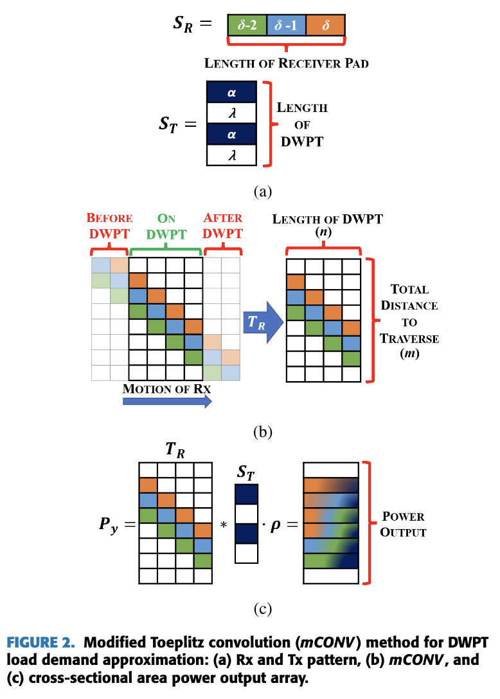

# Dynamic Wireless Power Transfer Demand Module
Traffic dynamics are simulated using the cell transmission model (CTM), which enables high-resolution modeling of dynamic wireless power transfer (DWPT) demand from electric vehicles (EVs). 
To translate macroscopic traffic simulation outputs to DWPT demand, we adapt a method called *mCONV* originally introduced in [Newbolt 2024a](https://ieeexplore.ieee.org/document/10750800) for DWPT load modeling with microscopic traffic simulation.
The method facilitates repeatable simulation with a single model of the spatial position-vs-power profile of the roadway and a separate, configurable model of the temporal time-vs-position profile for the vehicles on the roadway.
In this way, a diverse set of traffic simulation scenarios may be evaluated using the same model of the physical infrastructure.

## Conventional *mCONV*
The *mCONV* method was developed on the understanding that the relative motion of EV receiver (Rx) pads and roadway transmitter (Tx) pads is analogous to a convolution operation in mathematics, which determines the cross-sectional area generated by overlapping two distinct functions over their domain. The power-vs-position profile is generated by convolution and combined with a time-vs-position profile to produce a timeseries of DWPT load.

### Spatial Dependence
The Rx pad is a kernel $\mathbf{S_R}$ of length $\delta$ and magnitude $\beta_k$ that may depend on the index $k$ along the pad.
For simplicity, we use $\beta_k = \beta \space \forall k \in [0, \delta]$.

The physical layout of the Tx infrastructure along a DWPT corridor of length $n$ is encoded in $\mathbf{S_T} \in \mathbb{R}^{n \times 1}$, which is comprised of alternating patterns of "on" (where a single Tx pad is located) and "off" (where there is a gap between pads).
Without loss of generality, $\mathbf{S_T}$ may be constructed by repetition of a single "tile" describing a Tx pad of length $\alpha$ and gap distance $\lambda$.

Discrete convolution of $\mathbf{S_R}$ with $\mathbf{S_T}$ can be expressed by matrix multiplication after conversion of $\mathbf{S_R}$ into a Toeplitz matrix $\mathbf{T_R} \in \mathbb{R} ^ {m \times n}$, where $m$ is the number of available positions for an Rx pad on a vehicle traversing the corridor.
Multiplication by a factor $\gamma$, which converts spatial overlap to power transfer, produces the position-dependent power profile $\mathbf{P_y} \in \mathbb{R}^{m \times 1}$.
Physically, $\gamma$ represents the minimum of the Tx and Rx pad power, $\gamma = min(\beta, \beta').$

$$\mathbf{P_y} = \gamma \mathbf{T_R}  \mathbf{S_T}$$

For reference, see the image below from Newbolt et al. Note that, for reasons that will soon become clear, we have named the conversion factor $\gamma$, whereas in the figure it is indicated by $\rho$.

### Temporal Dependence
Assume that a vehicle's velocity $\mathbf{v} \in \mathbb{R}^{m \times 1}$ along the corridor $\mathbf{x} \in \mathbb{R}^{m \times 1}$ is known (e.g., through a traffic simulation module).
In that case, we can calculate the time spent by the vehicle at each position $x_j \forall j \in [0, m] $ along the roadway as 

$$ t_j = t_{j-1} + \frac{x_j - x_{j-1}}{\bar{v}_j}$$

where $\bar{v_j}$ is the average speed of the vehicle at $x_j$.

The result is a vector $\mathbf{t} \in \mathbb{R}^{m \times 1}$, which encodes the time-vs-position profile for a single vehicle.

### Putting It All Together
With $\mathbf{P_y}$ and $\mathbf{t}$ established, the total energy demand for a single vehicle traversing the DWPT corridor is found by discrete integration.

$$ \mathbf{E} = \sum_{j=1}^m \frac{P_{y,j-1} + P_{y,j}}{2} \Delta t_j$$

In the original *mCONV* formulation, multiple vehicle trajectories are modeled with a microscopic traffic simulation. Each trajectory is used to produce a vehicle-specific load profiles, which are summed across all vehicles in the simulation.

## Adapted *mCONV*
Here, we adapt the conventional *mCONV* method to make it suitable for integration with macroscopic traffic simulation outputs – specifically, outputs from the CTM.
The spatial dependence submodule remains unchanged, as this relates strictly to the physical dimensions of the system and not to the traffic simulation.
The temporal dependence submodule introduces the dependence on traffic dynamics, and as such it must be adapted to account for the fact that macroscopic traffic simulation describes the trajectory of vehicles in *aggregate*, and (specific to the CTM), assumes that vehicles within a single cell move identically.

The temporal dependence submodule is responsible for generating the time-vs-position profile. 
In a macroscopic simulation context, we are concerned with gross vehicle-hours rather than time-spent by a single vehicle.
As such, the relevant metric is the vehicle hours traveled (VHT) over time in each cell, which is already calculated by the CTM module.
This is a $N \times T$ matrix, where $N$ is the number of cells and $T$ is the number of timesteps, which is computed as:

$$ VHT[i,k] = \rho[i,k] \Delta x[i] \Delta t $$

Each row in $\mathbf{VHT}$ describes a timeseries of vehicle-hours-traveled within a given cell in the CTM, while each column describes the vehicle-hours-traveled on the freeway at a given moment in time.

The power-vs-position profile $\mathbf{P_y}$ that we generate in the spatial dependence submodule maps the power generated by a single Rx pad as it traverses the set of positions along the roadway.
To relate $\mathbf{VHT}$ to $\mathbf{P_y}$, we require a mapping between Rx pad position and cell index, which we call $\mathbf{M_{CTM}}$.
The transformation $\mathbf{M_{CTM}}$ takes the form of a $N \times m$ matrix, where each row $i$ describes the set of Rx pad positions attributed to cell $i$.
$\mathbf{M_{CTM}}$ serves a secondary purpose, which is to distribute the cell's vehicle-hours across the Rx pad positions within the cell.
For this purpose, we must assume that all vehicles move through the cell with uniform velocity, and thus spend equal time at each Rx pad position.

Entries in $\mathbf{M_{CTM}}$ are determined as shown below, where $n_i$ is the number of Rx pad positions included in cell $i$.

$$ M_{CTM}[i,j] = \frac{1}{n_i} \text{ if } j \in \text{cell } i, 0 \text{ otherwise}$$

Finally, as in the original *mCONV* method, we assume a constant EV fraction $\eta_{EV}$. 

Armed with $\mathbf{VHT}$, $\mathbf{M_{CTM}}$, and $\eta_{EV}$, we can now compute $\mathbf{E}$, the demand profile for the roadway indexed by time and Rx pad position:

$$ \mathbf{E} = \eta_{EV} * (\mathbf{VHT}^T \mathbf{M_{CTM}}) * \mathbf{P_y} $$

where $*$ denotes element-wise multiplication.

$\mathbf{E}$ is a $T \times m$ matrix, where entry $E[k,j]$ is the total energy delivered to EVs at position $j$ during timestep $k$, measured in Wh. 

Note that, as a result of our construction of $\mathbf{M_{CTM}}$, the load within a single cell spanning Rx pad positions $[j, j+l]$ is identical. 
This reflects the fact that in the CTM, vehicles within a given cell are assumed to move identically.
At the same time, by leaving the $\mathbf{P_y}$ construction unchanged, we are able to retain the realistic power profile which the *mCONV* method was invented to address.

### Key Assumptions
1. __Homogenous Vehicle Class__

    In v0, we assume that physical dimensions, power limits, and VHT are uniform across all vehicles in the simulation.
    In reality, heavy duty EVs would have a longer Rx pad length and higher rated power than passenger EVs; traffic dynamics may differ by vehicle class, introducing distinct VHT matrices.
    These complications are left to future work, however we note that the extension is straightforward (just use class-indexed $\mathbf{VHT}$ and $\mathbf{P_y}$).

1. __Single-lane Equivalent__
    
    In v0, we treat the roadway as a single-lane equivalent, i.e., density and flow are not distributed across lanes.
    This implicitly assumes that DWPT infrastructure spans every lane on the roadway.
    In reality, we expect DWPT infrastructure to be installed in a specific lane, which will require a lane-by-lane $\mathbf{VHT}$ and $\mathbf{P_y}$.
    As before, the extension is straightforward and left as future work.

1. __Ramp Handling__

    Ramps are not assumed to contain DWPT infrastructure, and as such we only include DWPT demand from EVs traveling on mainline segments.
    This requires removing ramp queue time from each cell's VHT tally, which is included by default in the CTM's VHT calculation.

1. __Tx Pad Power__

    We assume that vehicle headways are always strictly greater than $\alpha + \delta$ (4.5 m using the dimensions from Newbolt 2024a).
    As such, multiple Rx pads do not occupy the same Tx pad simultaneously, and the Tx pad delivers $\beta'$ to a single vehicle at all times.

### Validation Plan
To validate the adapted *mCONV* model, we plan to implement the car-following, multi-lane microsimulation described in [Newbolt 2024b](https://ieeexplore.ieee.org/document/10741859) for a small corridor and run the original *mCONV* over many sampled microscopic trajectories.
We will compare the resulting DWPT demand profile against one that we generate with a CTM + adapted *mCONV* approach, and confirm that the aggregate behavior is within the modeling tolerances.